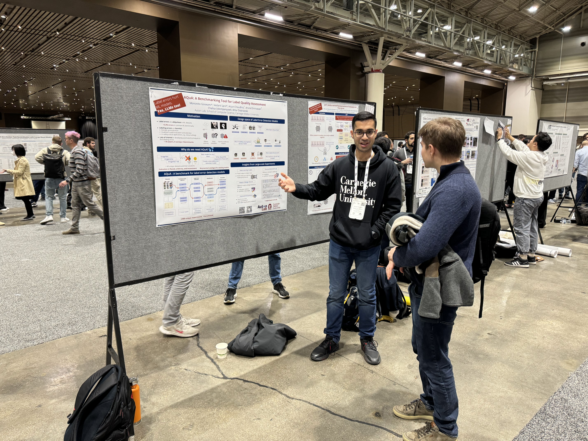

I am an incoming [ML PhD student](https://ml.gatech.edu/phd) at the [School of Computational Science and Engineering](https://cse.gatech.edu/) at [Georgia Institute of Technology](https://www.gatech.edu/), where I am advised by [Prof. B Aditya Prakash](https://faculty.cc.gatech.edu/~badityap/) at the [AdityaLab](https://adityalab.cc.gatech.edu/index.html).

I recently graduated with a [Master's degree](https://www.lti.cs.cmu.edu/people/students/choudhry-arjun.html) at the [Language Technologies Institute](https://www.lti.cs.cmu.edu/) at [Carnegie Mellon University](https://www.cmu.edu/), where I conducted research at the [Auton Lab](https://autonlab.org/) at the [School of Computer Science](https://www.cs.cmu.edu/) under the guidance of [Prof. Artur Dubrawski](https://www.ri.cmu.edu/ri-faculty/artur-w-dubrawski/).

Over the Summer of 2025, I am working with [Prof. Daphne Ippolito](https://www.daphnei.com/) and [Prof. Maarten Sap](https://maartensap.com/) at the [Language Technologies Institute](https://www.lti.cs.cmu.edu/) at [Carnegie Mellon University](https://www.cmu.edu/) on Multimodal Stance Detection for Detection of Harmful Memes on Social Media.

My research focuses on pushing the boundaries of foundation models beyond just text and image modalities. I am particularly interested in:

* Developing pragmatic multimodal foundation models capable of addressing multifaceted challenges across diverse data types including text, images, time series, audio, video, code, and tabular data. 
* Creating efficient inference methods for large-scale foundation models for deployment in edge devices.
* Designing comprehensive evaluation frameworks and benchmarks for analyzing systemic design flaws and reasoning ability of current state-of-the-art approaches.

Through the above three research directions, my goal is to create pragmatic, efficient, multimodal models for domain-specific applications, with a focus on healthcare.

Before joining CMU as a Master's Student in Fall 2023, I was a Visiting Research Intern (Remote) at the [Auton Lab](https://autonlab.org/) under the mentorship of [Dr. Mononito Goswami](https://mononitogoswami.github.io/) and [Prof. Artur Dubrawski](https://www.ri.cmu.edu/ri-faculty/artur-w-dubrawski/). I worked on benchmarking efforts for label quality assessment approaches. Prior to that, I was a Research Intern Scholar at the [Australian Artificial Intelligence Institute (AAII)](https://www.uts.edu.au/research/australian-artificial-intelligence-institute) at [University of Technology Sydney](https://www.uts.edu.au/) and a Research Associate & Lead at the [Biometric Research Laboratory](https://www.dtu.ac.in/Web/Departments/InformationTechnology/lab_and_infra/bml/index.php) at [Delhi Technological University](https://dtu.ac.in/), jointly advised by [Prof. Mukesh Prasad](https://profiles.uts.edu.au/Mukesh.Prasad/about) and [Prof. Dinesh Kumar Vishwakarma](https://sites.google.com/dtu.ac.in/dkv/home), working on adversarial models using emotional signals to effectively detect fake news on social media. I also worked on efficient approaches for influence maximization on social networks using heuristic and meta-heuristic approaches. I was also a Research Intern at [Université du Québec à Montréal](https://uqam.ca/) under [Prof. Marie-Jean Meurs](https://www.mjmrsc.com/index.html), working on adversarial adaptation of language models using external unlabeled corpora for applications in Named Entity Recognition.

I earned my Bachelor's in Information Technology from [Delhi Technological University](https://dtu.ac.in/) (erstwhile Delhi College of Engineering) in India, graduating top 2% in my department and top 0.5% in the university. I was advised by [Prof. Dinesh Kumar Vishwakarma](https://sites.google.com/dtu.ac.in/dkv/home) at the [Biometric Research Laboratory](https://www.dtu.ac.in/Web/Departments/InformationTechnology/lab_and_infra/bml/index.php), [Prof. Seba Susan](https://www.dtu.ac.in/Web/Departments/InformationTechnology/faculty/sebasusanrajan.php), and [Prof. Minni Jain](https://dtu.ac.in/modules/facilities/people/faculty/view.php?uname=minnijain). I was fortunate to be selected as a [MITACS Globalink Research Intern](https://www.mitacs.ca/our-programs/globalink-research-internship-students/) in Summer 2021 at [Université du Québec à Montréal](https://uqam.ca/), advised by [Prof. Marie-Jean Meurs](https://www.mjmrsc.com/index.html), where I worked on large-scale benchmarking of multilingual language models for downstream applications in Named Entity Recognition. After my graduation, DTU subsequently awarded me with the Commendable Researcher Award in 2024.

Feel free to drop me an email at arjuncho [at] andrew [dot] cmu [dot] edu if you are interested in my research and would like to discuss more!

I am very open to collaborations and mentoring students beginning their research journey in ML and NLP. If you want to collaborate, please feel free to reach out. I would love to connect! :)

My updated CV can be found [here](../Arjun_Choudhry_CV.pdf).